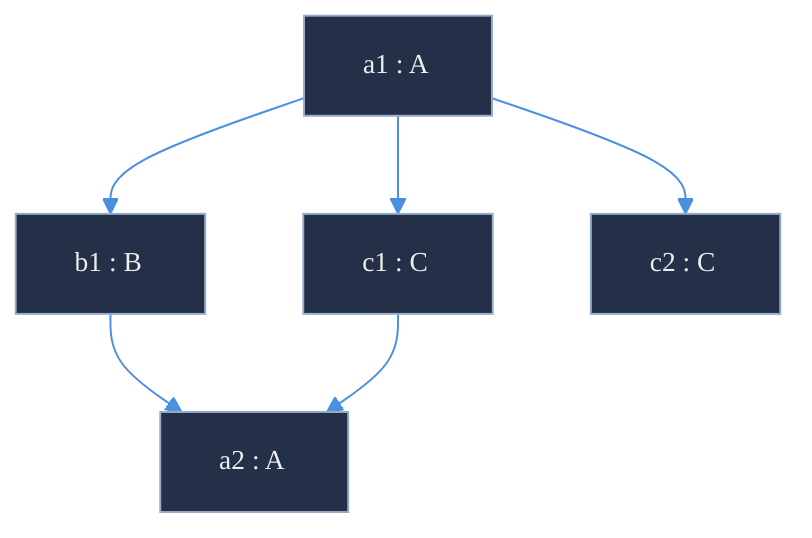

```mermaid
%%{init:{
  "theme": "base",
  "themeVariables": {
    "darkMode": true,
    "fontFamily": "Lato, sans-serif",
    "fontSize": "14px",
    "background": "#1E2A3A",
    "primaryColor": "#4A90E2",
    "textColor": "#FFFFFF",
    "nodeTextColor": "#FFFFFF",
    "lineColor": "#4A90E2",
    "mainBkg": "#233047",
    "actorTextColor": "#FFFFFF",
    "signalColor": "#FFFFFF",
    "signalTextColor": "#FFFFFF",
    "labelTextColor": "#FFFFFF",
    "sequenceNumberColor": "#FFFFFF"
  }
}}%%
graph TD
    A1["a1 : A"] --> B1["b1 : B"]
    A1 --> C1["c1 : C"]
    B1 --> A2["a2 : A"]
    A1 --> C2["c2 : C"]
    C1 --> A2
``` 