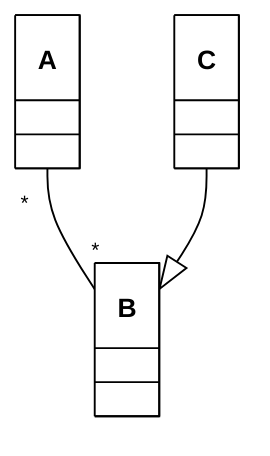

```mermaid
%%{init: {
  'theme': 'base',
  'themeVariables': {
    'primaryColor': '#ffffff',
    'primaryBorderColor': '#000000',
    'primaryTextColor': '#000000',
    'lineColor': '#000000',
    'fontFamily': 'arial',
    'fontSize': '14px',
    'tertiaryColor': '#ffffff'
  }
}}%%
classDiagram
    class A {
        
    }
    class B {
        
    }
    class C {
        
    }
    A "*" -- "*" B
    C --|> B
``` 