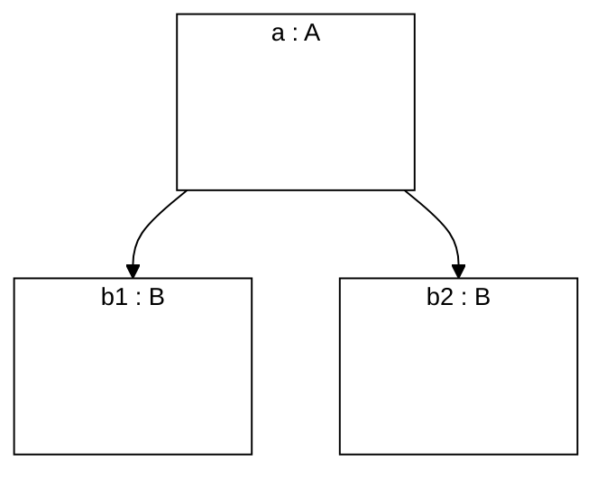

```mermaid
%%{init: {
  'theme': 'base',
  'themeVariables': {
    'primaryColor': '#ffffff',
    'primaryBorderColor': '#000000',
    'primaryTextColor': '#000000',
    'lineColor': '#000000',
    'fontFamily': 'arial',
    'fontSize': '14px',
    'tertiaryColor': '#ffffff'
  }
}}%%
graph TD
    subgraph a["a : A"]
    a1[" "]
    end
    subgraph b1["b1 : B"]
    b1_1[" "]
    end
    subgraph b2["b2 : B"]
    b2_1[" "]
    end
    a --> b1
    a --> b2
    style a fill:#ffffff,stroke:#000000
    style b1 fill:#ffffff,stroke:#000000
    style b2 fill:#ffffff,stroke:#000000
    style a1 fill:#ffffff,stroke:#ffffff
    style b1_1 fill:#ffffff,stroke:#ffffff
    style b2_1 fill:#ffffff,stroke:#ffffff
``` 