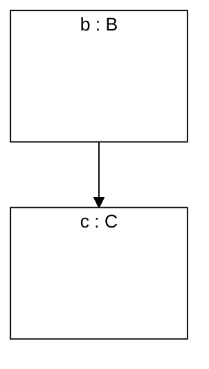

```mermaid
%%{init: {
  'theme': 'base',
  'themeVariables': {
    'primaryColor': '#ffffff',
    'primaryBorderColor': '#000000',
    'primaryTextColor': '#000000',
    'lineColor': '#000000',
    'fontFamily': 'arial',
    'fontSize': '14px',
    'tertiaryColor': '#ffffff'
  }
}}%%
graph TD
    subgraph b["b : B"]
    b1[" "]
    end
    subgraph c["c : C"]
    c1[" "]
    end
    b --> c
    style b fill:#ffffff,stroke:#000000
    style c fill:#ffffff,stroke:#000000
    style b1 fill:#ffffff,stroke:#ffffff
    style c1 fill:#ffffff,stroke:#ffffff
``` 