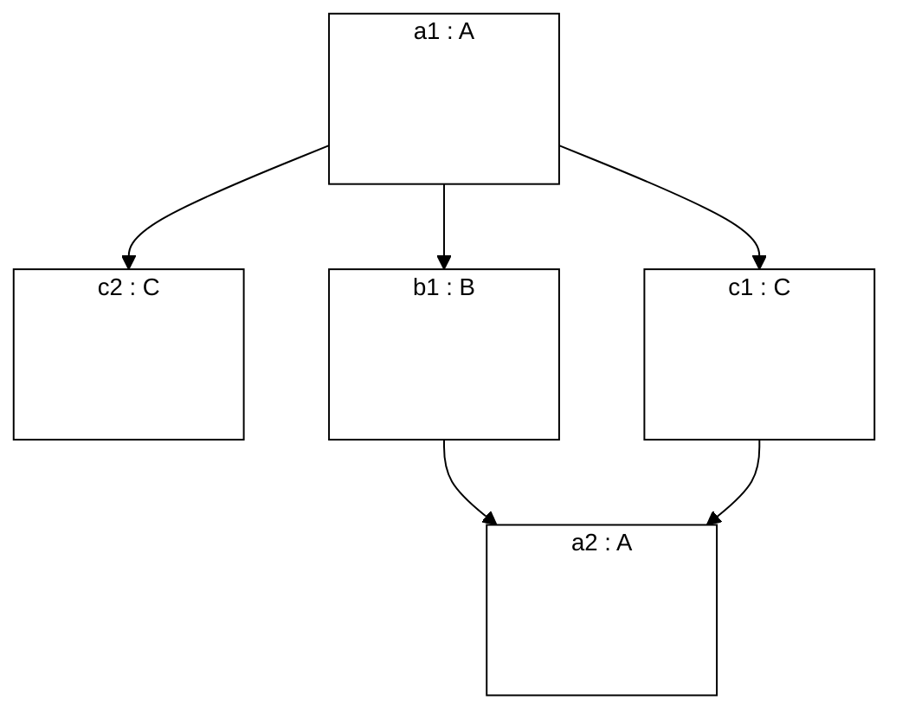

```mermaid
%%{init: {
  'theme': 'base',
  'themeVariables': {
    'primaryColor': '#ffffff',
    'primaryBorderColor': '#000000',
    'primaryTextColor': '#000000',
    'lineColor': '#000000',
    'fontFamily': 'arial',
    'fontSize': '14px',
    'tertiaryColor': '#ffffff'
  }
}}%%
graph TD
    subgraph a1["a1 : A"]
    a1_1[" "]
    end
    subgraph b1["b1 : B"]
    b1_1[" "]
    end
    subgraph c1["c1 : C"]
    c1_1[" "]
    end
    subgraph c2["c2 : C"]
    c2_1[" "]
    end
    subgraph a2["a2 : A"]
    a2_1[" "]
    end
    a1 --> b1
    a1 --> c1
    b1 --> a2
    a1 --> c2
    c1 --> a2
    style a1 fill:#ffffff,stroke:#000000
    style b1 fill:#ffffff,stroke:#000000
    style c1 fill:#ffffff,stroke:#000000
    style c2 fill:#ffffff,stroke:#000000
    style a2 fill:#ffffff,stroke:#000000
    style a1_1 fill:#ffffff,stroke:#ffffff
    style b1_1 fill:#ffffff,stroke:#ffffff
    style c1_1 fill:#ffffff,stroke:#ffffff
    style c2_1 fill:#ffffff,stroke:#ffffff
    style a2_1 fill:#ffffff,stroke:#ffffff
``` 