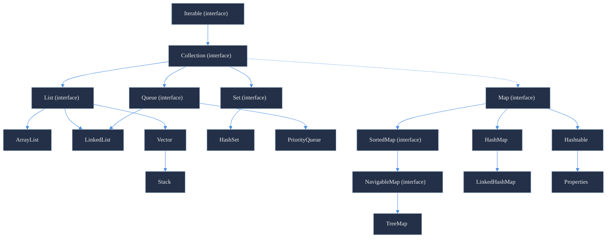

```mermaid
%%{init:{
  "theme": "base",
  "themeVariables": {
    "darkMode": true,
    "fontFamily": "Lato, sans-serif",
    "fontSize": "14px",
    "background": "#1E2A3A",
    "primaryColor": "#4A90E2",
    "textColor": "#FFFFFF",
    "nodeTextColor": "#FFFFFF",
    "lineColor": "#4A90E2",
    "mainBkg": "#233047",
    "actorTextColor": "#FFFFFF",
    "signalColor": "#FFFFFF",
    "signalTextColor": "#FFFFFF",
    "labelTextColor": "#FFFFFF",
    "sequenceNumberColor": "#FFFFFF"
  }
}}%%
graph TD
    A["Iterable<E> (interface)"] --> B["Collection<E> (interface)"]
    B --> C["List<E> (interface)"]
    B --> D["Set<E> (interface)"]
    B --> E["Queue<E> (interface)"]
    C --> H["ArrayList<E>"]
    C --> I["LinkedList<E>"]
    C --> J["Vector<E>"]
    J --> K["Stack<E>"]
    D --> L["HashSet<E>"]
    E --> O["PriorityQueue<E>"]
    E --> I
    B -.-> P["Map<K,V> (interface)"]
    P --> Q["SortedMap<K,V> (interface)"]
    Q --> R["NavigableMap<K,V> (interface)"]
    P --> S["HashMap<K,V>"]
    S --> T["LinkedHashMap<K,V>"]
    R --> U["TreeMap<K,V>"]
    P --> X["Hashtable<K,V>"]
    X --> Y["Properties"]

```
