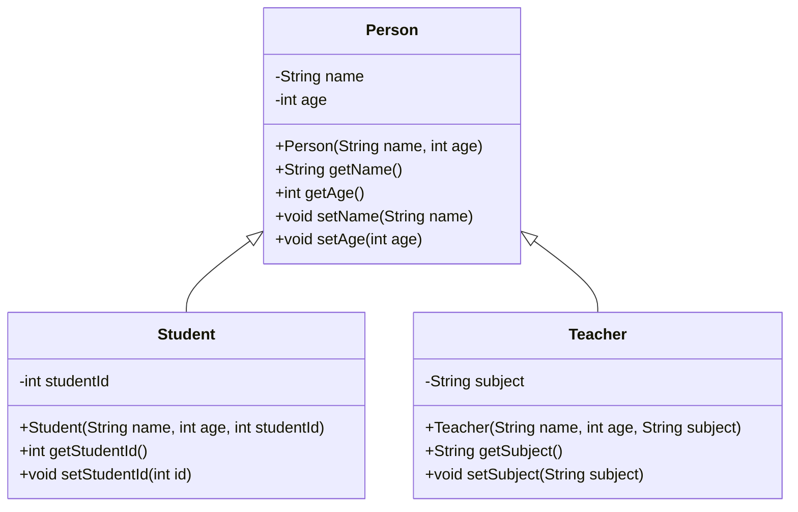

# UML Class Diagram Example

```mermaid
%% UML-style class diagram using Mermaid's classDiagram syntax
classDiagram
    class Person {
        -String name
        -int age
        +Person(String name, int age)
        +String getName()
        +int getAge()
        +void setName(String name)
        +void setAge(int age)
    }
    class Student {
        -int studentId
        +Student(String name, int age, int studentId)
        +int getStudentId()
        +void setStudentId(int id)
    }
    class Teacher {
        -String subject
        +Teacher(String name, int age, String subject)
        +String getSubject()
        +void setSubject(String subject)
    }
    Person <|-- Student
    Person <|-- Teacher
```
